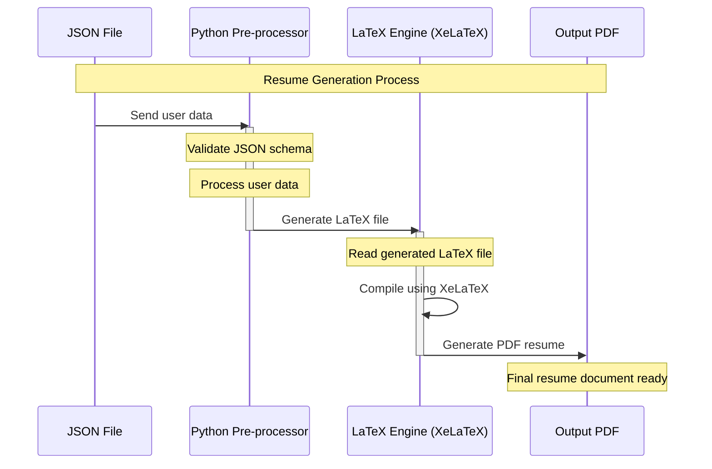

# Architecture

The architecture is pretty simple. We the the following components:

- **the json file**
- **the python pre-processor**
- **the LaTeX engine**

## The json file

The json file is the input to the system. It contains all the information about the user. The json file follows a custom schema. You can find the schema & the details about the fields in the [schema](../getting-started/data-json.md) file.

## The python pre-processor

The python pre-processor is responsible for reading the json file, processing the data, and generating the LaTeX file. This is the core of the system.xw

Find the source code for the python pre-processor [here.](https://github.com/ragarwalll/rahul-resume/tree/main/vitagen)

## The LaTeX engine

The LaTeX engine is responsible for generating the resume from the LaTeX file generated by the python pre-processor. The LaTeX engine uses the [XeLaTeX](https://www.overleaf.com/learn/latex/XeLaTeX) compiler to generate the PDF file.

Find more about the LaTeX engine [here.](./latex.md)

Find the source code for the LaTeX template [here.](https://github.com/ragarwalll/rahul-resume/blob/main/resume.tex)
