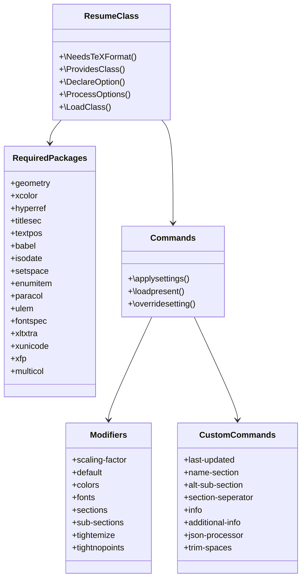
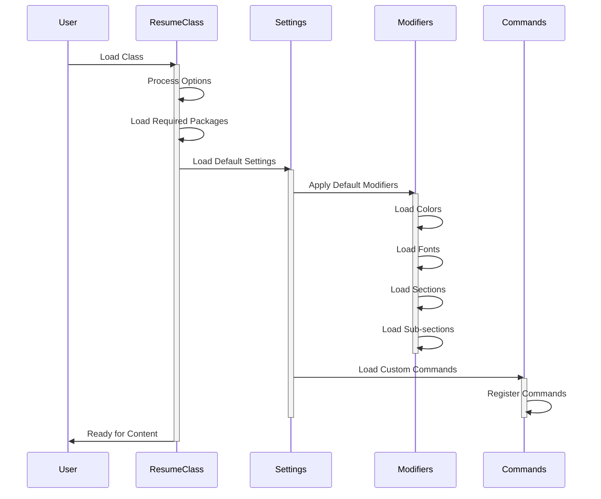

# LaTeX Engine

In simple terms, the LaTeX engine is responsible for generating the resume from the LaTeX file generated by the python pre-processor. The LaTeX engine uses the [XeLaTeX](https://www.overleaf.com/learn/latex/XeLaTeX) compiler to generate the PDF file.

We have a LaTeX Class file that defines the structure of the resume. The class file is used to generate the resume from the LaTeX file generated by the python pre-processor.

Find the class file for the LaTeX template [here.](https://github.com/ragarwalll/rahul-resume/blob/main/resume.cls)

## Components in the LaTeX Engine

## How does it work?

